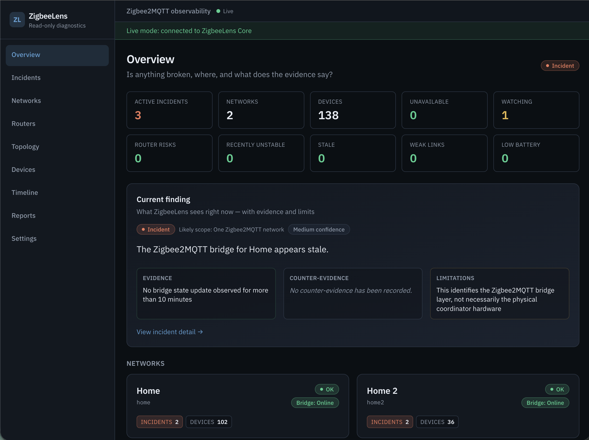
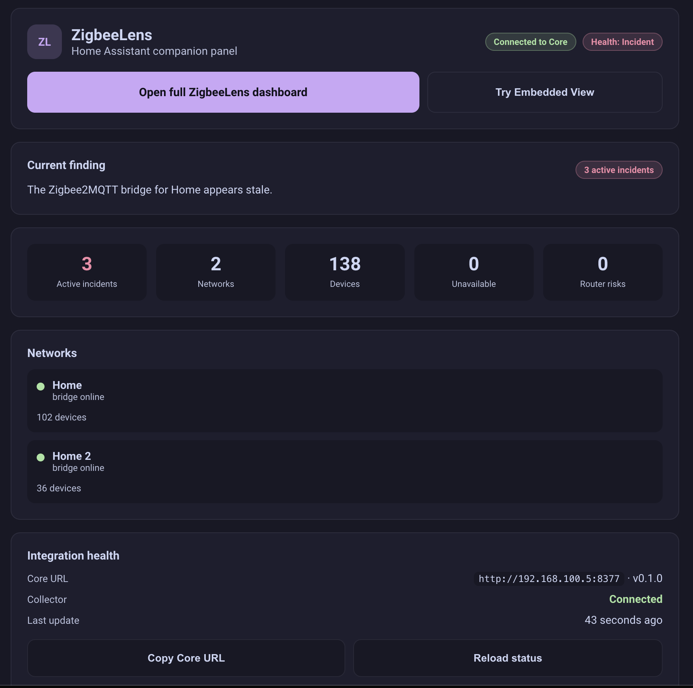
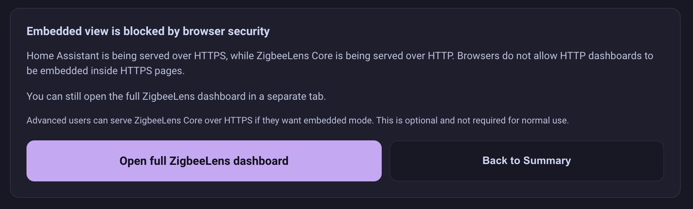
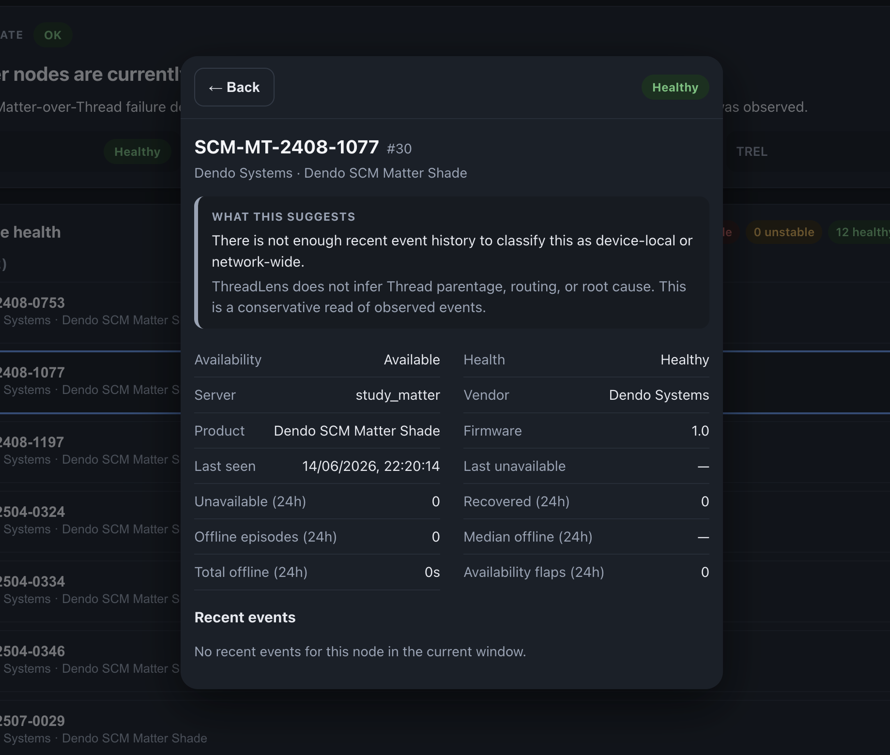

# ZigbeeLens

**Read-only diagnostics for Zigbee2MQTT networks.**

Understand your Zigbee mesh before you change it.

ZigbeeLens is a read-only observability and diagnostic console for Zigbee2MQTT networks. It watches Zigbee2MQTT over MQTT, keeps local history, detects health and instability patterns, explains likely scope using evidence and limitations, and generates redacted reports for troubleshooting.

ZigbeeLens is part of the **Lens family** of read-only home-network observability tools, alongside [ThreadLens](https://github.com/theaussiepom/threadlens). See [docs/lens-family.md](docs/lens-family.md) for shared conventions.

ZigbeeLens does **not** repair, reset, remove, re-pair, or mutate Zigbee devices.

## What it is

- Read-only observability for Zigbee2MQTT
- Incident-first diagnostic dashboard
- Multi-network support (`network_id` + `ieee_address` identity)
- Router and mesh risk visibility
- Local SQLite history and stored reports
- Redacted JSON, YAML, and Markdown exports
- Home Assistant OS add-on, Docker/Compose, HACS integration
- Optional MQTT Discovery summary entities
- Optional topology snapshots and Home Assistant enrichment

## What it is not

- Not a Zigbee controller
- Not a Zigbee2MQTT replacement
- Not a repair tool
- Not a root-cause oracle
- Not a Lovelace dashboard recipe

## Key safety promises

- Does not remove devices
- Does not reset devices
- Does not permit join
- Does not change channels
- Does not configure, bind, or unbind devices
- Does not run OTA
- Does not publish Zigbee2MQTT `set` or request topics (except one optional, confirmed network-map request)
- Topology capture is optional and explicitly confirmed
- Reports are redacted before storage and download

See [docs/safety-audit.md](docs/safety-audit.md) for the full safety audit.

## Screenshots

Real screenshots from a live Beast deployment (`home` + `home2` networks). See [docs/screenshots/](docs/screenshots/) for source files.

### ZigbeeLens Core dashboard



The Overview page is the default entry point: live collector status, active incidents, network summaries, and evidence-backed findings.

### Home Assistant HACS companion panel



The HACS integration provides a native companion panel plus **Open Full Dashboard** (new tab). HTTP Core URLs work for this path — no reverse proxy required.



When Home Assistant uses HTTPS and Core uses HTTP, the panel shows a calm explanation instead of a broken iframe. Use an HTTPS Core URL only if you want embedded view — see [docs/hacs-embedded-view.md](docs/hacs-embedded-view.md).

### HACS config flow



The setup dialog explains HTTP vs HTTPS Core URLs, optional SSL verification, and the sidebar companion panel toggle.

### More views

| Overview | Incidents |
|----------|-----------|
| _Add `docs/screenshots/incidents-page.png`_ | _Screenshot placeholder — Incident detail_ |

| Devices | Reports |
|---------|---------|
| _Screenshot placeholder — Device drilldown_ | _Add `docs/screenshots/reports-page.png`_ |

## Install

| Path | Repo |
|------|------|
| [Home Assistant OS add-on](docs/addon-dev.md) | [theaussiepom/zigbeelens-addons](https://github.com/theaussiepom/zigbeelens-addons) |
| [Docker / Compose](docs/docker.md) | `ghcr.io/theaussiepom/zigbeelens` |
| [HACS integration](docs/hacs.md) | [theaussiepom/zigbeelens-hacs](https://github.com/theaussiepom/zigbeelens-hacs) |
| [MQTT Discovery](docs/mqtt-discovery.md) | Optional summary HA entities without HACS |
| [Topology](docs/topology.md) | Optional mesh enrichment — disabled by default |

## Quick start

### Home Assistant OS

1. Add the ZigbeeLens add-on repository.
2. Install and configure the ZigbeeLens add-on (MQTT broker, network `base_topic` values).
3. Start the add-on.
4. Open ZigbeeLens via Ingress.

Details: [docs/addon-dev.md](docs/addon-dev.md)

### Docker

```bash
mkdir -p config data
cp deploy/docker/config.example.yaml config/config.yaml
# Edit config/config.yaml — set mqtt.server and networks[].base_topic

./scripts/build-docker.sh
docker compose -f deploy/docker/docker-compose.example.yaml up -d
```

Open **http://localhost:8377**

Details: [docs/docker.md](docs/docker.md)

### Home Assistant / HACS integration

The HACS integration is optional. It gives Home Assistant:

- a native ZigbeeLens companion panel
- summary sensors and binary sensors
- diagnostics and repairs
- a button to open the full ZigbeeLens dashboard

The full ZigbeeLens dashboard is served by ZigbeeLens Core.

For Docker users, an HTTP Core URL such as `http://192.168.1.10:8377` is fine. The native Home Assistant panel works, and the **Open Full Dashboard** button opens the full dashboard in a new tab.

The optional **Try Embedded View** button can show the full dashboard inside Home Assistant only when browser security allows it. In practice, if Home Assistant is served over HTTPS, the ZigbeeLens Core URL also needs to be HTTPS for embedded view to work.

You do not need HTTPS or a reverse proxy for normal HACS use. Change the Core URL anytime under **Settings → Devices & services → ZigbeeLens → Configure**.

Details: [docs/hacs.md](docs/hacs.md) · [docs/hacs-embedded-view.md](docs/hacs-embedded-view.md)

### Development (mock scenarios)

```bash
pnpm install
python3 -m venv apps/core/.venv && source apps/core/.venv/bin/activate
pip install -e "apps/core[dev]"
pnpm --filter @zigbeelens/shared build
export ZIGBEELENS_CONFIG=config/config.yaml
./scripts/dev.sh
```

Open http://localhost:5173 and switch mock scenarios from the header dropdown.

Details: [docs/development.md](docs/development.md)

## Configuration

Key settings in `config.yaml`:

| Setting | Description |
|---------|-------------|
| `mqtt.server` | MQTT broker URI |
| `networks[].id` | Stable network identifier — do not change casually |
| `networks[].name` | Display label only |
| `networks[].base_topic` | Zigbee2MQTT base topic (must match exactly) |
| `storage.path` | SQLite database path |
| `storage.retention_days` | Telemetry retention (default 7 days; purged on startup) |
| `diagnostics.*` | Health and incident thresholds |
| `reports.*` | Report limits and defaults |
| `topology.enabled` | **false** by default |
| `features.mqtt_discovery` + `mqtt_discovery.enabled` | **false** by default |

See [deploy/docker/config.example.yaml](deploy/docker/config.example.yaml) for a full example.

## Reports

Generate scoped diagnostic reports from the Reports page or `POST /api/reports`.

- **JSON** — structured data for tools
- **YAML** — human-readable structured export
- **Markdown** — forum and GitHub friendly

Redaction profiles: `standard`, `public_safe`, `strict`. Reports are redacted **before** storage and download.

Details: [docs/reports.md](docs/reports.md) · [docs/redaction.md](docs/redaction.md)

## Known limitations

- ZigbeeLens observes MQTT and Zigbee2MQTT data — it cannot prove RF interference.
- It cannot prove the current physical route without an optional topology snapshot.
- Topology is point-in-time and may be slow or unavailable on large networks.
- Battery and LQI reporting vary by device firmware and configuration.
- Availability depends on Zigbee2MQTT `availability` feature being enabled.
- Some sleepy end devices report infrequently by design.
- Diagnostics use correlation language — not definitive root-cause claims.

## Security model

ZigbeeLens Core does **not** include built-in authentication in v0.1.0.

ZigbeeLens is read-only with respect to Zigbee control. It does not perform device-control actions such as permit join, remove, reset, bind/unbind, OTA, or channel changes.

Some API routes can modify ZigbeeLens’ own local data, such as creating/deleting reports, requesting a topology snapshot, or storing Home Assistant enrichment metadata. If you expose Core beyond users or networks you trust, access-control decisions are your responsibility.

For broader access, consider firewall rules, Home Assistant Ingress, network isolation, or an authenticated reverse proxy such as Authentik, Cloudflare Access, Authelia, or basic auth. HTTPS may be useful for the optional embedded dashboard view, but **HTTPS is not authentication**.

Details: [docs/security.md](docs/security.md) · [SECURITY.md](SECURITY.md)

## Documentation

| Topic | Doc |
|-------|-----|
| Architecture | [docs/architecture.md](docs/architecture.md) |
| Development | [docs/development.md](docs/development.md) |
| HAOS add-on | [docs/addon-dev.md](docs/addon-dev.md) |
| Docker | [docs/docker.md](docs/docker.md) |
| HACS | [docs/hacs.md](docs/hacs.md) |
| HACS embedded view (optional HTTPS) | [docs/hacs-embedded-view.md](docs/hacs-embedded-view.md) |
| MQTT Discovery | [docs/mqtt-discovery.md](docs/mqtt-discovery.md) |
| Topology | [docs/topology.md](docs/topology.md) |
| Reports | [docs/reports.md](docs/reports.md) |
| Redaction | [docs/redaction.md](docs/redaction.md) |
| Troubleshooting | [docs/troubleshooting.md](docs/troubleshooting.md) |
| Backups | [docs/backups.md](docs/backups.md) |
| Upgrades | [docs/upgrades.md](docs/upgrades.md) |
| Release | [docs/release.md](docs/release.md) |
| Pre-release smoke test | [docs/release-test.md](docs/release-test.md) |
| Contributing | [CONTRIBUTING.md](CONTRIBUTING.md) |

## Mock scenarios

Fourteen regression fixtures are available in mock mode:

| Scenario | Description |
|----------|-------------|
| `all_ok_single_network` | Healthy single network |
| `all_ok_multi_network` | Healthy multi-network |
| `single_device_unavailable` | Isolated device outage |
| `four_devices_same_room_unavailable` | Correlated mesh segment incident (default) |
| `bridge_offline` | Bridge offline |
| `one_network_incident_other_network_ok` | Multi-network isolation |
| `router_risk_candidate` | Router risk with correlated devices |
| `stale_battery_devices` | Stale battery device |
| `low_battery_cluster` | Low battery cluster |
| `interview_failures` | Interview failure |
| `unknown_insufficient_data` | Insufficient telemetry |
| `multiple_networks_unstable` | Multi-network instability |
| `weak_link_devices` | Weak link quality |
| `stale_reporting_cluster` | Stale reporting cluster |

Set `ZIGBEELENS_MOCK_SCENARIO` or use `?scenario=` in the UI.

## API overview

| Endpoint | Description |
|----------|-------------|
| `GET /api/health` | Core, collector, discovery, topology status |
| `GET /api/dashboard` | Overview payload |
| `GET /api/networks`, `/api/devices`, `/api/routers` | Inventory |
| `GET /api/incidents`, `/api/timeline` | Diagnostics |
| `GET/POST/DELETE /api/reports*` | Redacted reports |
| `GET/POST /api/topology*` | Optional topology (capture requires confirmation) |
| `GET/POST/DELETE /api/enrichment/*` | Optional HA enrichment |
| `GET /api/events/stream` | SSE live updates |

Interactive docs: `http://localhost:8377/docs`

## License

MIT — see [LICENSE](LICENSE)

## Contributing

Contributions welcome. See [CONTRIBUTING.md](CONTRIBUTING.md).

Report security issues privately — see [SECURITY.md](SECURITY.md).
