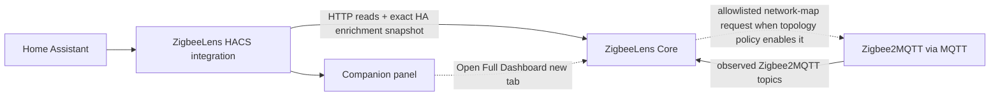

# HACS integration

Home Assistant bridge to **ZigbeeLens Core** — summary entities, a native companion panel, diagnostics, and repairs.

The ZigbeeLens Home Assistant integration provides a sidebar companion entry
with a native summary and an **Open Full Dashboard** button. Embedded Core view
is opt-in via **Try Embedded View** when browser mixed-content rules allow;
HTTPS Home Assistant cannot embed HTTP Core, while HTTP Home Assistant may
embed HTTPS Core. Invalid URLs stay on the native summary / blocked fallback.

The Core dashboard is **canonical**. The integration does not collect MQTT or
replace the dashboard.

The ZigbeeLens integration can store an optional **Core API token** and sends
it only as `Authorization: Bearer <token>` from Home Assistant’s server-side
HTTP client. Leave the token blank for trusted-open Core. The token is never
placed in the Core URL, panel config, websocket summary, iframe URL, or **Open
Full Dashboard** href. Standalone browser login exists only when Core has both
`security.api_token` and `security.session_secret`; bearer-only Core leaves the
bundled browser UI locked.

## Release status — local/staged integration only

**Public HACS installation is unavailable for this reviewed branch.** The
public `theaussiepom/zigbeelens-hacs` satellite is not synchronized with the
reviewed staged package and must not be used to validate this branch.
Synchronizing or publishing that repository requires a separate explicitly
authorized publication task. Docker/Compose is the current portable Core
deployment route.

The candidate stage advertises the previously unused version `0.1.14`; the
materially different public satellite still advertises `0.1.13` at the latest
re-check. The candidate version therefore identifies the staged tree uniquely,
but the tree mismatch remains a publication blocker until a separately
authorized publication task makes the intended satellite tree identical.

Phase 7C1 is merged. The runtime package now owns durable options, fail-closed
Core/Decision compatibility, distinct Decision payload repairs, declarative and
runtime single-entry enforcement, exact Home Assistant compatibility lanes,
and generated official-validation workflows. Phase 7C2 screenshots and Phase
7D live Beast validation remain deferred.

Public installation remains unavailable until a separately authorized
publication task:

- makes the complete staged and satellite trees identical;
- assigns a version that uniquely identifies that tree;
- runs the generated exact Home Assistant matrix and official HACS/hassfest
  checks on the synchronized satellite; and
- records and inspects those remote results before publication.

Local structural packaging and local matrix results are not substitutes for
those remote satellite checks.

## Local staged integration testing

Use a clean, disposable Home Assistant test instance. HACS is not used for this
branch test. The canonical compatibility matrix is exact and reviewed on
2026-07-23:

| Lane | Home Assistant | Python |
|------|----------------|--------|
| Minimum | `2025.1.0` | `3.12` |
| Current | `2026.7.3` | `3.14` |

`apps/ha_integration/ha-test-matrix.json`, the two exact requirements files,
monorepo CI, and the generated HACS CI use those same pins. Run either lane
locally with `bash scripts/test-ha-integration-matrix.sh minimum` or
`bash scripts/test-ha-integration-matrix.sh current`.

1. From the monorepo root, generate and validate the reviewed staged package:

   ```bash
   ./scripts/package-hacs-repo.sh
   bash dist/zigbeelens-hacs/scripts/validate-hacs-repo.sh
   ```

2. Run ZigbeeLens Core at an HTTP(S) origin reachable from Home Assistant. The
   documented portable path is standalone Docker; see
   [release-test.md](release-test.md) for pre-release `:edge` testing.
3. Copy the generated integration directory—not the whole staged repository—so
   its files land at
   `<home-assistant-config>/custom_components/zigbeelens/`:

   ```bash
   HA_CONFIG=/path/to/home-assistant-config
   mkdir -p "${HA_CONFIG}/custom_components"
   test ! -e "${HA_CONFIG}/custom_components/zigbeelens"
   cp -R dist/zigbeelens-hacs/custom_components/zigbeelens \
     "${HA_CONFIG}/custom_components/"
   test -f "${HA_CONFIG}/custom_components/zigbeelens/manifest.json"
   ```

   On HAOS, the configuration root is normally `/config`. Use a clean
   destination; for an update, stop Home Assistant and replace the existing
   `custom_components/zigbeelens` directory as one unit rather than merging
   package versions.
4. Perform a full Home Assistant restart so the custom component is loaded.
5. Open **Settings → Devices & services → Add Integration → ZigbeeLens**.

Do not add the public satellite as a HACS custom repository for this test.

Only one ZigbeeLens config entry/Core target is supported. The manifest declares
`single_config_entry: true`; config-flow concurrency checks and setup-time
singleton ownership remain as runtime defenses.


The setup dialog explains HTTP vs HTTPS Core URLs, optional SSL verification, and the companion panel sidebar toggle.

Pre-release Core image: `ghcr.io/theaussiepom/zigbeelens:edge`

Setup defaults:

| Setting | Default |
|---------|---------|
| Core URL | `http://localhost:8377` — replace unless Core really shares Home Assistant's network namespace |
| API token | blank |
| Verify SSL | `false` |
| Panel enabled | `true` |
| Poll interval | `60` seconds; Configure accepts and persists `15` to `900` |

## Core URL

Use a URL **reachable from Home Assistant**:

| Deployment | Typical URL |
|------------|-------------|
| Docker on LAN | `http://<docker-host-ip>:8377` |
| Same Compose network | `http://zigbeelens:8377` |
| HTTPS reverse proxy (optional) | `https://zigbeelens.example.com` |

The value must be an exact HTTP(S) origin: no path, query, fragment, embedded
credentials, or trailing application route. Use `localhost` only when Home
Assistant Core and ZigbeeLens Core truly share a network namespace.

The Home Assistant add-on is deferred and defines no portable HACS backend
origin. Do not use `http://localhost:8377` as an add-on URL. Run standalone Core
at a Home-Assistant-reachable origin when testing HACS entities and the
companion panel.

The companion panel renders status from the integration (over the HA websocket) and does not require the browser to reach Core directly. The **Open Full Dashboard** button opens the configured Core URL in a new tab, so that URL must be reachable from your browser.

Use **Reconfigure** on the integration to change the Core URL, TLS verification,
or API token. Use **Configure** (options) for panel visibility and polling
interval. When Core rejects credentials, Home Assistant offers linked
**reauthentication**.

The OptionsFlow returns panel visibility and the selected 15–900-second
`scan_interval` as the authoritative options result. Home Assistant persists
that result and the registered update listener performs one effective reload,
so the coordinator is recreated with the selected interval.

Home Assistant reloads the config entry after Configure, Reconfigure, or
successful reauthentication changes. Integration logs are in Home Assistant's
normal logs; redacted diagnostics are available from the ZigbeeLens integration
or device diagnostics menu.

### Core URL and embedded view

The Core URL is the address Home Assistant uses to reach ZigbeeLens Core.

Examples:

- `http://192.168.1.10:8377`
- `http://zigbeelens:8377`
- `https://zigbeelens.example.com`

**HTTP Core URLs are supported** and are the normal Docker path. They work for:

- the native HACS companion panel
- entities, repairs, and diagnostics
- the **Open Full Dashboard** button

The optional embedded dashboard view follows browser security rules. If Home Assistant is loaded over HTTPS and ZigbeeLens Core is loaded over HTTP, the browser will not allow the dashboard to be embedded inside Home Assistant.

To use embedded view, use an **HTTPS Core URL**, such as one provided by your existing reverse proxy. This is optional — you do not need HTTPS or a reverse proxy for the native, non-embedded companion path.

## Deployment paths

**Docker + locally staged companion test:**

1. Run Core at `http://<host>:8377`.
2. Install the generated custom component using the local staged procedure
   above.
3. Add the integration with your Core URL.
4. Use the sidebar **companion panel** for status.
5. Click **Open Full Dashboard** for the complete UI (opens in a new tab), or **Try Embedded View** when browser security allows embedding.

No reverse proxy is required for a good sidebar experience.

**HAOS add-on:**

- The add-on is deferred and is not part of the current HACS release.
- Do not enter `http://localhost:8377`; the add-on publishes no direct port and
  this repository does not define a portable HACS-to-add-on Core origin.

**Advanced Docker (optional):**

- You may reverse proxy Core over HTTPS for direct browser access, SSE through a proxy, or **HACS Try Embedded View** when Home Assistant is HTTPS. See **[HACS embedded view — optional HTTPS reverse proxy](hacs-embedded-view.md)** for the Caddy example and certificate trust steps.
- A reverse proxy is **not** required for the native companion panel or **Open Full Dashboard**.

## Security

The HACS integration is **not** an authentication layer for ZigbeeLens Core. Changing the Core URL to HTTPS is for optional embedded-view browser compatibility, not authentication.

The panel and websocket summary are available to every authenticated Home
Assistant user, not only administrators. They expose the Core URL, network
labels, factual counts, and projected priority text. Limit Home Assistant
accounts accordingly.

If your Core URL is reachable by users or networks you do not trust, consider firewall rules, network isolation, Home Assistant Ingress, or an authenticated reverse proxy.

ZigbeeLens remains read-only for Zigbee control. Some Core API routes modify ZigbeeLens local data only (reports, topology snapshots, HA enrichment metadata). See [security.md](security.md).

## Home Assistant enrichment

The integration's normal coordinator reads Core health/diagnostic data,
configuration status, the Decision Dashboard, and capabilities. A separate
enrichment manager reads the bounded `/api/v1/devices` inventory and owns the
only integration write: exact contract-v1
`POST /api/v1/enrichment/homeassistant`. Explicit config-entry removal may call
the exact DELETE for that same resource. The client exposes no generic mutation
method and does not publish MQTT.

For each complete HA registry snapshot the integration:

1. reads the official device, entity, and area registries;
2. prefers the HA user-facing device name, resolves a device or unanimous
   entity area, and chooses one deterministic representative entity;
3. extracts exactly one reviewed Zigbee IEEE candidate;
4. resolves it against Core inventory to a final exact
   `(network_id, ieee_address)` identity; and
5. sends a bounded, strict snapshot sorted deterministically.

HA names and areas are additional display metadata. Core preserves the
Zigbee2MQTT `friendly_name`, and the HA user rename is never identity evidence.
When one IEEE exists in multiple Core networks, reviewed original registry-name
evidence may select a row only when exactly one Core friendly name matches;
otherwise the candidate is ambiguous and omitted. Conflicting HA device or
representative entity ownership also fails closed.

A complete accepted empty snapshot is a real replacement and clears
enrichment. An unavailable HA registry, incomplete/invalid Core inventory,
unsupported capability, or transient HTTP/auth/server failure sends no
replacement, so Core retains the last accepted snapshot. The manager owns the
initial sync, debounced official registry listeners, bounded retry, and forced
15-minute reconciliation. Unload cancels those owners; reload does not clear
Core. Explicit config-entry removal attempts the exact clear without preventing
removal if Core is unavailable.

## Architecture



## Decision contract (Track 5 / v2)

The companion displays shared Decision Engine status and investigation priorities
only when Core advertises an **exact** supported contract **and** the fetched
Dashboard payload contains the contracted decision surfaces.

Current supported contract:

- `decision_contract_version = 2` only

Core exposes the contract on `GET /api/capabilities` (also `/api/v1/capabilities`):

- `decision_contract_version`
- `capabilities.shared_decisions`
- `capabilities.companion_decision_summary`
- `capabilities.decision_only_diagnostic_payloads`
- `capabilities.report_contract_v3`
- `capabilities.decision_mqtt_summary`
- `capabilities.legacy_health_lens_payloads` (must be `false`)
- `decision_surfaces.dashboard_decision_summary`
- `decision_surfaces.dashboard_investigation_priorities`
- `decision_surfaces.dashboard_data_coverage_warnings`
- `decision_surfaces.network_decision_badges`
- `decision_surfaces.device_decision_badges`

### Dashboard payload validation

Contract negotiation is not enough. The Dashboard response must include:

- a valid `decision_summary`: non-negative `subject_count` and
  `coverage_warning_count`, known `overall_status` and `highest_priority`, and
  non-negative `status_counts`/`priority_counts` whose totals and highest values
  agree with the subject count;
- `investigation_priorities` as a JSON list (may be empty);
- `data_coverage_warnings` as a JSON list (may be empty);
- non-negative integer factual counts for active/watching incidents, devices,
  and unavailable devices (plus `network_count` when present);
- `networks` as a list whose rows contain a valid decision badge, valid decision
  count summary, and non-negative device/unavailable/active-incident counts.

Semantics:

| Situation | Companion behaviour |
|-----------|---------------------|
| Valid empty priority list | Decision mode on; empty state: “No current investigation priorities from stored evidence.” |
| Valid priorities | Decision mode on; show up to three Core priorities, then “+N more…” |
| Missing / non-list surface | Soft disable decision mode; no Health/Lens fallback |
| Missing/older contract or required capability | Soft disable; older-contract repair recommends updating Core |
| Newer contract | Soft disable; newer-contract repair recommends updating the integration, not Core |
| Malformed capabilities/contract | Soft disable; malformed-contract repair, with no guessed upgrade |
| Exact v2 with missing/malformed Dashboard Decision data | Soft disable; payload-specific repair that does not prescribe a Core upgrade |
| Core below minimum version | Decision mode off; Home Assistant repair for incompatible Core |

Malformed individual priority rows are skipped calmly during panel projection. A malformed
whole surface disables decision mode.

### Compatibility tri-state

Diagnostics and the native panel report Core compatibility as:

- **Compatible** — observed Core version meets the minimum
- **Incompatible** — observed Core version is below the minimum
- **Unknown** — Core is disconnected / version not yet observed

Unknown must never be rendered as Compatible. Decision mode requires explicit
`shared_decisions_available === true` and `core_version_compatible === true`.

The explicit internal states are:

- Core version: `compatible`, `incompatible`, `unknown`;
- capabilities response: `accepted`, `unavailable`, `malformed`;
- Decision contract: `supported_exact`, `missing`, `older`, `newer`,
  `malformed`, `missing_required_capability`;
- Decision payload: `valid`, `missing`, `malformed`; and
- enrichment contract: `supported`, `unsupported`, `missing`, `malformed`,
  `unavailable`.

Missing or malformed Core versions fail closed as `unknown`. Decision mode
requires a compatible Core, exact supported contract, and valid Dashboard
Decision payload. Repairs preserve the older/newer/malformed/payload distinction
described above; authentication alone owns reauthentication.

### Native panel projection

- Pass-through Core `priority`, `title`, and `summary` (escaped for HTML)
- Cap at three priorities; expose factual `more_investigation_priority_count`
- Factual `data_coverage_warning_count` only (no coverage-copy mapping)
- Per-network factual `investigation_priority_count`
- No HACS Decision copy tables, score, action_group, card_type, or device IEEE lists
- Aggregate priority/coverage counts are not coloured as Watch/severity

### Presentation paths

1. **Native companion summary (default):** status/launcher surface with Open Full Dashboard
   and optional Try Embedded View. Contract-gated priorities apply only on this path.
2. **Opt-in embedded Core:** Try Embedded View enters iframe mode when browser
   mixed-content rules allow; Back to Summary returns to the native panel even
   if CSP blocks the iframe.
3. **Blocked / mixed-content fallback:** HTTPS HA + HTTP Core (and invalid URLs) stay on
   the friendly blocked view without trapping the panel.

**Open Full ZigbeeLens dashboard** remains the reliable route into the full evidence UI.

Diagnostics include safe factual fields:

- `decision_contract_version`
- `shared_decisions_available`
- `core_version_compatible`

The companion projection adds no per-priority or per-Device-Story entities and
no Zigbee controls. The overall/count decision summary entities listed below
remain read-only.

Do not treat future contract versions as compatible until this HACS package is updated
for them.

## HACS vs MQTT Discovery

| | HACS integration | MQTT Discovery |
|---|------------------|----------------|
| Current availability | Local/staged custom-component testing; public satellite unsynchronized | Optional Core feature |
| Enablement | Manual custom-component install from the generated stage | Config flag in Core |
| Config flow / repairs | Yes | No |
| Native companion panel | Yes | No |
| Summary entities | Yes | Yes |

See [MQTT Discovery](mqtt-discovery.md). You generally do not need both.

## Entities (examples)

Factual / lifecycle (stable unique IDs retained):

- `binary_sensor.zigbeelens_active_incident`
- `binary_sensor.zigbeelens_core_connected`
- `binary_sensor.zigbeelens_mqtt_collector_connected`
- `sensor.zigbeelens_unavailable_devices`
- `sensor.zigbeelens_network_count`
- `sensor.zigbeelens_device_count`
- `sensor.zigbeelens_router_risks`
- `sensor.zigbeelens_watch_devices`
- `sensor.zigbeelens_incident_state`

Decision-led (new unique IDs — do not reuse superseded health entity IDs):

- `sensor.zigbeelens_overall_decision`
- `sensor.zigbeelens_review_first_devices`
- `sensor.zigbeelens_worth_reviewing_devices`
- `sensor.zigbeelens_coverage_warning_count`
- Per-network `…_decision`, `…_unavailable_devices`, and `…_router_risks`

Per-network entities are enumerated at integration platform setup. Reload the
integration after adding or renaming Core networks. Registry entries for
removed networks can remain as unavailable entities until removed manually.

Superseded health-derived entities (`overall_health`, recently-unstable / weak-link /
stale / low-battery / unknown counts, per-network `_health`) are no longer registered.
Remove leftover unavailable entities from the Home Assistant entity registry manually.

## Conditional public HACS installation

These are future instructions, not a current branch-validation route. Restore
public custom-repository installation only after all of these gates close:

- the staged tree matches the intended satellite tree exactly;
- the manifest/package version uniquely identifies that tree, remains unused,
  and has not already been published;
- exact Home Assistant `2025.1.0` / Python `3.12` and Home Assistant
  `2026.7.3` / Python `3.14` coverage passes;
- generated official HACS and hassfest validation passes remotely on the
  synchronized satellite; and
- explicit publication authorization is recorded.

Only then may an operator add
`https://github.com/theaussiepom/zigbeelens-hacs` as a HACS Integration custom
repository, install ZigbeeLens, restart Home Assistant, and add the integration
under **Settings → Devices & services**.

## Upgrade or remove

- During local/staged testing, stop Home Assistant, replace
  `<home-assistant-config>/custom_components/zigbeelens` as one unit with the
  newly generated directory, then perform a full restart.
- To remove the staged integration, delete its ZigbeeLens config entry under
  **Settings → Devices & services**, stop Home Assistant, remove the manually
  installed `custom_components/zigbeelens` directory, and restart. This does
  not stop Core or delete ZigbeeLens's SQLite data.
- HACS-managed upgrade/uninstall applies only to a future synchronized,
  authorized public artifact.

## Monorepo / packaging

Source: `apps/ha_integration/`. Generate the local staging tree with:

```bash
./scripts/package-hacs-repo.sh
```

Output: `dist/zigbeelens-hacs/`. This is a generated staging directory, not a
Git checkout or publication authorization. Do not push it from this workflow.
A separate authorized publication task must compare the complete staged and
satellite trees, preserve the candidate's unique version identity, and pass the
synchronization gates above.

## Validation

```bash
./scripts/validate-ha-integration.sh
```

## Related

- [Pre-release smoke test](release-test.md)
- [HACS embedded view (optional HTTPS reverse proxy)](hacs-embedded-view.md)
- [HA integration README](../apps/ha_integration/README.md)
- [Docker](docker.md)
- [Add-on dev](addon-dev.md)
