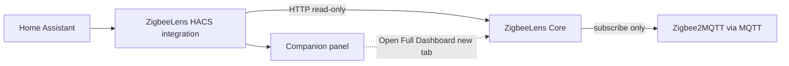

# HACS integration

Home Assistant bridge to **ZigbeeLens Core** — summary entities, a native companion panel, diagnostics, and repairs.

The HACS sidebar provides a **native companion panel** with an **Open Full Dashboard** button. This works for normal Docker installs without a reverse proxy. The full ZigbeeLens dashboard is served by Core and opens separately.

> Embedded iframe behaviour is intentionally **not** the default because browsers block HTTP dashboards inside HTTPS Home Assistant sessions. A reverse proxy is optional and only needed by advanced users who want an embedded view.

The Core dashboard is **canonical**. HACS does not collect MQTT or replace the dashboard.

## Install via HACS (recommended)

1. Run ZigbeeLens Core (Docker or add-on) — see [release-test.md](release-test.md) for pre-release `:edge` testing.
2. In Home Assistant: **HACS → Integrations → Custom repositories**
3. Add: **https://github.com/theaussiepom/zigbeelens-hacs**
4. Category: **Integration**
5. Install **ZigbeeLens** and restart Home Assistant if prompted
6. **Settings → Devices & services → Add Integration → ZigbeeLens**

Pre-release Core image: `ghcr.io/theaussiepom/zigbeelens:edge`

## Core URL

Use a URL **reachable from Home Assistant**:

| Deployment | Typical URL |
|------------|-------------|
| Docker on LAN | `http://<docker-host-ip>:8377` |
| Same Compose network | `http://zigbeelens:8377` |
| HAOS add-on (Core in same namespace) | `http://localhost:8377` |

Do not use `localhost` unless HA and Core share the same network namespace.

The companion panel renders status from the integration (over the HA websocket) and does not require the browser to reach Core directly. The **Open Full Dashboard** button opens the configured Core URL in a new tab, so that URL must be reachable from your browser.

## Deployment paths

**Docker + HACS (normal path):**

1. Run Core at `http://<host>:8377`.
2. Install the HACS integration.
3. Add the integration with your Core URL.
4. Use the sidebar **companion panel** for status.
5. Click **Open Full Dashboard** for the complete UI (opens in a new tab).

No reverse proxy is required for a good sidebar experience.

**HAOS add-on:**

- The add-on / Ingress is the embedded full-dashboard path.
- HACS remains optional for entities and repairs.

**Advanced Docker:**

- You may reverse proxy Core over HTTPS if you specifically want an embedded view, but this is not the normal path and is not required.

## Architecture



## HACS vs MQTT Discovery

| | HACS integration | MQTT Discovery |
|---|------------------|----------------|
| Install | HACS custom repository | Config flag in Core |
| Config flow / repairs | Yes | No |
| Native companion panel | Yes | No |
| Summary entities | Yes | Yes |
| Recommended default | **Yes** | Optional |

See [MQTT Discovery](mqtt-discovery.md). You generally do not need both.

## Entities (examples)

- `binary_sensor.zigbeelens_active_incident`
- `sensor.zigbeelens_overall_health`
- `sensor.zigbeelens_unavailable_devices`
- `sensor.zigbeelens_router_risks`
- Per-network health and unavailable sensors

## Monorepo / packaging

Source: `apps/ha_integration/`. Published HACS repo:

```bash
./scripts/package-hacs-repo.sh
```

Output: `dist/zigbeelens-hacs/` → push to https://github.com/theaussiepom/zigbeelens-hacs

## Validation

```bash
./scripts/validate-ha-integration.sh
```

## Related

- [Pre-release smoke test](release-test.md)
- [HA integration README](../apps/ha_integration/README.md)
- [Docker](docker.md)
- [Add-on dev](addon-dev.md)
