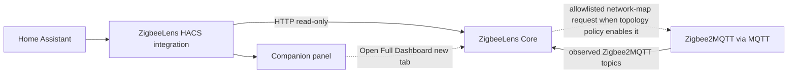

# HACS integration

Home Assistant bridge to **ZigbeeLens Core** — summary entities, a native companion panel, diagnostics, and repairs.

The HACS sidebar provides a ZigbeeLens companion entry with a native summary and an **Open Full Dashboard** button. Embedded Core view is opt-in via **Try Embedded View** when schemes match; mixed-content or invalid URLs stay on the native summary / blocked fallback.

The Core dashboard is **canonical**. HACS does not collect MQTT or replace the dashboard.

HACS can store an optional **Core API token** and sends it only as
`Authorization: Bearer <token>` from Home Assistant’s server-side HTTP client.
Leave the token blank for trusted-open Core. Against the Home Assistant add-on,
configure the same optional add-on bearer-fallback token if you want HACS
entities/native panel; the add-on ingress UI does not use that token and does
not transfer it into HACS automatically. The token is never placed in the Core
URL, panel config, websocket summary, iframe URL, or **Open Full Dashboard**
href — those browser paths use ingress identity (add-on) or standalone UI
session login (Docker/standalone).

## Install via HACS (recommended)

1. Run ZigbeeLens Core (Docker or add-on) — see [release-test.md](release-test.md) for pre-release `:edge` testing.
2. In Home Assistant: **HACS → Integrations → Custom repositories**
3. Add: **https://github.com/theaussiepom/zigbeelens-hacs**
4. Category: **Integration**
5. Install **ZigbeeLens** and restart Home Assistant if prompted
6. **Settings → Devices & services → Add Integration → ZigbeeLens**


The setup dialog explains HTTP vs HTTPS Core URLs, optional SSL verification, and the companion panel sidebar toggle.

Pre-release Core image: `ghcr.io/theaussiepom/zigbeelens:edge`

## Core URL

Use a URL **reachable from Home Assistant**:

| Deployment | Typical URL |
|------------|-------------|
| Docker on LAN | `http://<docker-host-ip>:8377` |
| Same Compose network | `http://zigbeelens:8377` |
| HAOS add-on (Core in same namespace) | `http://localhost:8377` |
| HTTPS reverse proxy (optional) | `https://zigbeelens.example.com` |

Do not use `localhost` unless HA and Core share the same network namespace.

The companion panel renders status from the integration (over the HA websocket) and does not require the browser to reach Core directly. The **Open Full Dashboard** button opens the configured Core URL in a new tab, so that URL must be reachable from your browser.

Use **Reconfigure** on the integration to change the Core URL, TLS verification,
or API token. Use **Configure** (options) for panel visibility and polling
interval. When Core rejects credentials, Home Assistant offers linked
**reauthentication**.

### Core URL and embedded view

The Core URL is the address Home Assistant uses to reach ZigbeeLens Core.

Examples:

- `http://192.168.1.10:8377`
- `http://zigbeelens:8377`
- `https://zigbeelens.example.com`

**HTTP Core URLs are supported** and are the normal Docker path. They work for:

- the native HACS companion panel
- entities, repairs, and diagnostics
- the **Open Full Dashboard** button

The optional embedded dashboard view follows browser security rules. If Home Assistant is loaded over HTTPS and ZigbeeLens Core is loaded over HTTP, the browser will not allow the dashboard to be embedded inside Home Assistant.

To use embedded view, use an **HTTPS Core URL**, such as one provided by your existing reverse proxy. This is optional — you do not need HTTPS or a reverse proxy for normal HACS use.

## Deployment paths

**Docker + HACS (normal path):**

1. Run Core at `http://<host>:8377`.
2. Install the HACS integration.
3. Add the integration with your Core URL.
4. Use the sidebar **companion panel** for status.
5. Click **Open Full Dashboard** for the complete UI (opens in a new tab), or **Try Embedded View** when browser security allows embedding.

No reverse proxy is required for a good sidebar experience.

**HAOS add-on:**

- The add-on / Ingress is the embedded full-dashboard path.
- HACS remains optional for entities and repairs.

**Advanced Docker (optional):**

- You may reverse proxy Core over HTTPS for direct browser access, SSE through a proxy, or **HACS Try Embedded View** when Home Assistant is HTTPS. See **[HACS embedded view — optional HTTPS reverse proxy](hacs-embedded-view.md)** for the Caddy example and certificate trust steps.
- A reverse proxy is **not** required for the native companion panel or **Open Full Dashboard**.

## Security

The HACS integration is **not** an authentication layer for ZigbeeLens Core. Changing the Core URL to HTTPS is for optional embedded-view browser compatibility, not authentication.

If your Core URL is reachable by users or networks you do not trust, consider firewall rules, network isolation, Home Assistant Ingress, or an authenticated reverse proxy.

ZigbeeLens remains read-only for Zigbee control. Some Core API routes modify ZigbeeLens local data only (reports, topology snapshots, HA enrichment metadata). See [security.md](security.md).

## Architecture



## Decision contract (Track 5 / v2)

The companion displays shared Decision Engine status and investigation priorities
only when Core advertises an **exact** supported contract **and** the fetched
Dashboard payload contains the contracted decision surfaces.

Current supported contract:

- `decision_contract_version = 2` only

Core exposes the contract on `GET /api/capabilities` (also `/api/v1/capabilities`):

- `decision_contract_version`
- `capabilities.shared_decisions`
- `capabilities.companion_decision_summary`
- `capabilities.decision_only_diagnostic_payloads`
- `capabilities.legacy_health_lens_payloads` (must be `false`)
- `decision_surfaces.dashboard_decision_summary`
- `decision_surfaces.dashboard_investigation_priorities`
- `decision_surfaces.dashboard_data_coverage_warnings`
- `decision_surfaces.network_decision_badges`
- `decision_surfaces.device_decision_badges`

### Dashboard payload validation

Contract negotiation is not enough. The Dashboard response must include:

- `decision_summary` with `overall_status` and `status_counts`
- `investigation_priorities` as a JSON list (may be empty)
- `data_coverage_warnings` as a JSON list (may be empty)

Semantics:

| Situation | Companion behaviour |
|-----------|---------------------|
| Valid empty priority list | Decision mode on; empty state: “No current investigation priorities from stored evidence.” |
| Valid priorities | Decision mode on; show up to three Core priorities, then “+N more…” |
| Missing / non-list surface | Soft disable decision mode; no Health/Lens fallback |
| Unsupported / malformed / older / newer contract | Soft disable decision mode; repair `core_decision_contract_incompatible`; no reauth |
| Core below minimum version | Decision mode off; Home Assistant repair for incompatible Core |

Malformed individual priority rows are skipped calmly during panel projection. A malformed
whole surface disables decision mode.

### Compatibility tri-state

Diagnostics and the native panel report Core compatibility as:

- **Compatible** — observed Core version meets the minimum
- **Incompatible** — observed Core version is below the minimum
- **Unknown** — Core is disconnected / version not yet observed

Unknown must never be rendered as Compatible. Decision mode requires explicit
`shared_decisions_available === true` and `core_version_compatible === true`.

### Native panel projection

- Pass-through Core `priority`, `title`, and `summary` (escaped for HTML)
- Cap at three priorities; expose factual `more_investigation_priority_count`
- Factual `data_coverage_warning_count` only (no coverage-copy mapping)
- Per-network factual `investigation_priority_count`
- No HACS Decision copy tables, score, action_group, card_type, or device IEEE lists
- Aggregate priority/coverage counts are not coloured as Watch/severity

### Presentation paths

1. **Native companion summary (default):** status/launcher surface with Open Full Dashboard
   and optional Try Embedded View. Contract-gated priorities apply only on this path.
2. **Opt-in embedded Core:** Try Embedded View enters iframe mode when schemes match;
   Back to Summary returns to the native panel even if CSP blocks the iframe.
3. **Blocked / mixed-content fallback:** HTTPS HA + HTTP Core (and invalid URLs) stay on
   the friendly blocked view without trapping the panel.

**Open Full ZigbeeLens dashboard** remains the reliable route into the full evidence UI.

Diagnostics include safe factual fields:

- `decision_contract_version`
- `shared_decisions_available`
- `core_version_compatible`

Phase 5E adds **no** Home Assistant decision entities and **no** Zigbee controls. Shared
decisions stay read-only.

Do not treat future contract versions as compatible until this HACS package is updated
for them.

## HACS vs MQTT Discovery

| | HACS integration | MQTT Discovery |
|---|------------------|----------------|
| Install | HACS custom repository | Config flag in Core |
| Config flow / repairs | Yes | No |
| Native companion panel | Yes | No |
| Summary entities | Yes | Yes |
| Recommended default | **Yes** | Optional |

See [MQTT Discovery](mqtt-discovery.md). You generally do not need both.

## Entities (examples)

Factual / lifecycle (stable unique IDs retained):

- `binary_sensor.zigbeelens_active_incident`
- `sensor.zigbeelens_unavailable_devices`
- `sensor.zigbeelens_network_count`
- `sensor.zigbeelens_device_count`
- `sensor.zigbeelens_router_risks`

Decision-led (new unique IDs — do not reuse superseded health entity IDs):

- `sensor.zigbeelens_overall_decision`
- `sensor.zigbeelens_review_first_devices`
- `sensor.zigbeelens_worth_reviewing_devices`
- `sensor.zigbeelens_coverage_warning_count`
- Per-network `…_decision` and factual unavailable sensors

Superseded health-derived entities (`overall_health`, recently-unstable / weak-link /
stale / low-battery / unknown counts, per-network `_health`) are no longer registered.
Remove leftover unavailable entities from the Home Assistant entity registry manually.

## Monorepo / packaging

Source: `apps/ha_integration/`. Published HACS repo:

```bash
./scripts/package-hacs-repo.sh
```

Output: `dist/zigbeelens-hacs/` → push to https://github.com/theaussiepom/zigbeelens-hacs

## Validation

```bash
./scripts/validate-ha-integration.sh
```

## Related

- [Pre-release smoke test](release-test.md)
- [HACS embedded view (optional HTTPS reverse proxy)](hacs-embedded-view.md)
- [HA integration README](../apps/ha_integration/README.md)
- [Docker](docker.md)
- [Add-on dev](addon-dev.md)
