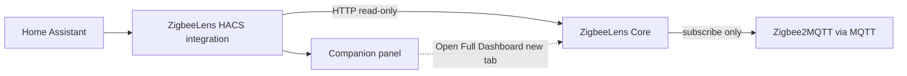

# HACS integration

Home Assistant bridge to **ZigbeeLens Core** — summary entities, a native companion panel, diagnostics, and repairs.

The HACS sidebar provides a **native companion panel** by default, with an **Open Full Dashboard** button (new tab). When Home Assistant and Core share the same protocol (both HTTP or both HTTPS), the panel **auto-embeds** the full Core dashboard in the sidebar. Mixed content (HTTPS HA + HTTP Core) keeps the native summary panel instead.

The Core dashboard is **canonical**. HACS does not collect MQTT or replace the dashboard.

## Install via HACS (recommended)

1. Run ZigbeeLens Core (Docker or add-on) — see [release-test.md](release-test.md) for pre-release `:edge` testing.
2. In Home Assistant: **HACS → Integrations → Custom repositories**
3. Add: **https://github.com/theaussiepom/zigbeelens-hacs**
4. Category: **Integration**
5. Install **ZigbeeLens** and restart Home Assistant if prompted
6. **Settings → Devices & services → Add Integration → ZigbeeLens**


The setup dialog explains HTTP vs HTTPS Core URLs, optional SSL verification, and the companion panel sidebar toggle.

Pre-release Core image: `ghcr.io/theaussiepom/zigbeelens:edge`

## Core URL

Use a URL **reachable from Home Assistant**:

| Deployment | Typical URL |
|------------|-------------|
| Docker on LAN | `http://<docker-host-ip>:8377` |
| Same Compose network | `http://zigbeelens:8377` |
| HAOS add-on (Core in same namespace) | `http://localhost:8377` |
| HTTPS reverse proxy (optional) | `https://zigbeelens.example.com` |

Do not use `localhost` unless HA and Core share the same network namespace.

The companion panel renders status from the integration (over the HA websocket) and does not require the browser to reach Core directly. The **Open Full Dashboard** button opens the configured Core URL in a new tab, so that URL must be reachable from your browser.

You can change the Core URL later without deleting the integration: **Settings → Devices & services → ZigbeeLens → Configure**.

### Core URL and embedded view

The Core URL is the address Home Assistant uses to reach ZigbeeLens Core.

Examples:

- `http://192.168.1.10:8377`
- `http://zigbeelens:8377`
- `https://zigbeelens.example.com`

**HTTP Core URLs are supported** and are the normal Docker path. They work for:

- the native HACS companion panel
- entities, repairs, and diagnostics
- the **Open Full Dashboard** button

The optional embedded dashboard view follows browser security rules. If Home Assistant is loaded over HTTPS and ZigbeeLens Core is loaded over HTTP, the browser will not allow the dashboard to be embedded inside Home Assistant.

To use embedded view, use an **HTTPS Core URL**, such as one provided by your existing reverse proxy. This is optional — you do not need HTTPS or a reverse proxy for normal HACS use.

## Deployment paths

**Docker + HACS (normal path):**

1. Run Core at `http://<host>:8377`.
2. Install the HACS integration.
3. Add the integration with your Core URL.
4. Use the sidebar **companion panel** for status.
5. Click **Open Full Dashboard** for the complete UI (opens in a new tab), or **Try Embedded View** when browser security allows embedding.

No reverse proxy is required for a good sidebar experience.

**HAOS add-on:**

- The add-on / Ingress is the embedded full-dashboard path.
- HACS remains optional for entities and repairs.

**Advanced Docker (optional):**

- You may reverse proxy Core over HTTPS for direct browser access, SSE through a proxy, or **HACS Try Embedded View** when Home Assistant is HTTPS. See **[HACS embedded view — optional HTTPS reverse proxy](hacs-embedded-view.md)** for the Caddy example and certificate trust steps.
- A reverse proxy is **not** required for the native companion panel or **Open Full Dashboard**.

## Security

The HACS integration is **not** an authentication layer for ZigbeeLens Core. Changing the Core URL to HTTPS is for optional embedded-view browser compatibility, not authentication.

If your Core URL is reachable by users or networks you do not trust, consider firewall rules, network isolation, Home Assistant Ingress, or an authenticated reverse proxy.

ZigbeeLens remains read-only for Zigbee control. Some Core API routes modify ZigbeeLens local data only (reports, topology snapshots, HA enrichment metadata). See [security.md](security.md).

## Architecture



## Decision contract (Phase 5E)

Before the companion shows Decision Engine summaries, it checks Core compatibility:

1. `GET /api/capabilities` (also `/api/v1/capabilities`) exposes:
   - `decision_contract_version` (currently `1`)
   - `capabilities.shared_decisions`
   - `capabilities.companion_decision_summary`
   - `decision_surfaces` for Overview/device/report decision fields
2. The integration sets soft flags on the panel summary:
   - `shared_decisions_available`
   - `decision_contract_version`
   - `core_version_compatible`
3. Older Core builds that omit these fields keep working — companion decision display stays off.
4. Hard incompatibilities (Core below the absolute minimum version) raise a Home Assistant repair issue.

The companion must not invent its own decision wording. Shared Decision Engine statuses from Core remain authoritative.

## HACS vs MQTT Discovery

| | HACS integration | MQTT Discovery |
|---|------------------|----------------|
| Install | HACS custom repository | Config flag in Core |
| Config flow / repairs | Yes | No |
| Native companion panel | Yes | No |
| Summary entities | Yes | Yes |
| Recommended default | **Yes** | Optional |

See [MQTT Discovery](mqtt-discovery.md). You generally do not need both.

## Entities (examples)

- `binary_sensor.zigbeelens_active_incident`
- `sensor.zigbeelens_overall_health`
- `sensor.zigbeelens_unavailable_devices`
- `sensor.zigbeelens_router_risks`
- Per-network health and unavailable sensors

## Monorepo / packaging

Source: `apps/ha_integration/`. Published HACS repo:

```bash
./scripts/package-hacs-repo.sh
```

Output: `dist/zigbeelens-hacs/` → push to https://github.com/theaussiepom/zigbeelens-hacs

## Validation

```bash
./scripts/validate-ha-integration.sh
```

## Related

- [Pre-release smoke test](release-test.md)
- [HACS embedded view (optional HTTPS reverse proxy)](hacs-embedded-view.md)
- [HA integration README](../apps/ha_integration/README.md)
- [Docker](docker.md)
- [Add-on dev](addon-dev.md)
