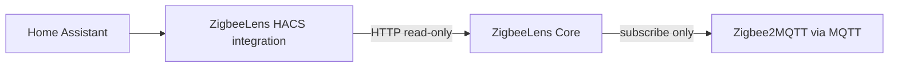

# ZigbeeLens HACS integration

This document describes installing and using the ZigbeeLens Home Assistant integration from the monorepo.

## Architecture



- **ZigbeeLens Core** collects MQTT telemetry, stores history, runs health/incident engines, and hosts the dashboard.
- **HACS integration** is the Home Assistant bridge: config flow, summary entities, panel, diagnostics, repairs.

## HACS vs MQTT Discovery

| | HACS integration | MQTT Discovery |
|---|------------------|----------------|
| Install | HACS custom integration | Config flag in Core |
| Config flow / repairs | Yes | No |
| Sidebar panel | Yes | No |
| Summary entities | Yes | Yes |
| Recommended default | **Yes** | Optional |

See [MQTT Discovery](mqtt-discovery.md) for the optional MQTT-only entity path. You generally do not need both enabled.

## Install paths

### HAOS add-on users

1. Install and start the ZigbeeLens add-on.
2. Install the HACS integration (see below).
3. Add **ZigbeeLens** integration.
4. Use Core URL `http://localhost:8377` unless your environment requires the add-on hostname.
5. Enable the sidebar panel if desired.

### Docker users

1. Run ZigbeeLens with Docker/Compose.
2. Install the HACS integration.
3. Add **ZigbeeLens** integration with Core URL `http://<host>:8377`.
4. Enable the sidebar panel if desired.

## HACS packaging

Source layout:

```
apps/ha_integration/
  custom_components/zigbeelens/
  hacs.json
  README.md
```

HACS expects `custom_components/` at the repository root for default installs. Package a release without moving monorepo source:

```bash
./scripts/package-hacs.sh
```

Output:

```
dist/hacs/zigbeelens/
  custom_components/zigbeelens/...
  hacs.json
  README.md
```

Publish `dist/hacs/zigbeelens/` as a HACS-compatible repository or attach it to GitHub releases.

`hacs.json` sets `"content_in_root": false` because the integration lives under `apps/ha_integration/` in the monorepo. Release packaging copies artifacts to the HACS-expected layout.

## Manual install

Copy `apps/ha_integration/custom_components/zigbeelens` to `config/custom_components/zigbeelens` and restart Home Assistant.

## Validation

```bash
./scripts/validate-ha-integration.sh
```

## Related docs

- [HA integration README](../apps/ha_integration/README.md)
- [Docker deployment](docker.md)
- [HAOS add-on](addon.md)
