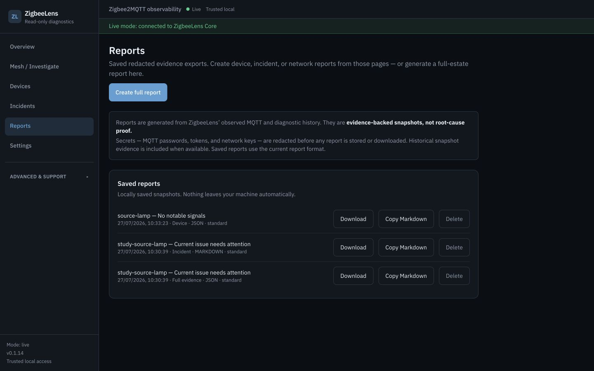
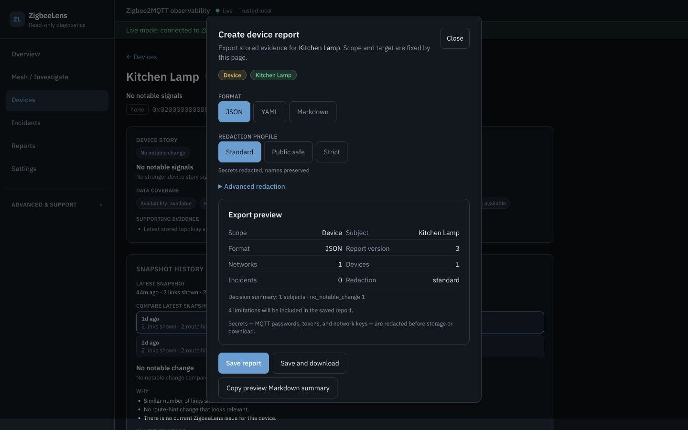

# Reports

ZigbeeLens generates scoped, evidence-oriented reports from local SQLite
history and the current decision-led diagnostic state. A report records what
Core observed and the limitations of that evidence; it does not prove a root
cause or a live Zigbee route.

> **Screenshot status:** Phase 7C2 is complete and merged in PR #108. Reviewed
> head `1ea2949ab09038cdfe94d1c6d6b8e5fd45d8d87f` landed as evidence merge
> `93fb26617042ed46d8920a7b75a42e3ae9da4d62`; all S1–S9 assets retain
> immutable runtime capture source
> `af04ee906b71de77ee6e0eb5d866c0647d502410`. Required checks were green and
> the S4 recorded-severity `Incident` versus recorded-confidence `High` finding
> was resolved. Public HACS synchronization and the final HACS/artifact pairing
> remain pending, so Phase 7D remains blocked.



Illustrative synthetic release-candidate data. This final-candidate evidence
was captured from source `af04ee906b71de77ee6e0eb5d866c0647d502410` on
`2026-07-29`. The image shows the current saved-report summary collection,
including visible generated time, scope, format, redaction profile, and
saved-report actions. The exact `ReportDetailV3` stored body, per-collection
timeline bounds, `/api` and `/api/v1` parity, structured downloads, and
clipboard Markdown were validated mechanically; they are not visual claims
about this summary-only collection.

## Current contract: exact ReportDetailV3

Previewed, newly stored, fetched, and structured downloaded reports use exact
integer `report_version: 3`. `ReportDetailV3` requires these canonical fields:

| Section | Field |
|---------|-------|
| Identity | `id`, `product`, `report_version`, `generated_at`, `version` |
| Scope / format | `scope`, `format` |
| Configuration | `config_summary` |
| Redaction | `redaction` |
| Decisions | `decision_summary`, `investigation_priorities`, `device_stories` |
| Coverage | `data_coverage_warnings` |
| Incidents | `incidents` |
| Collector | `collector_status` |
| Domain facts | `domain_details` |
| Timeline | `events_or_timeline` |
| Limits / counts | `limitations`, `raw_counts` |
| Markdown rendering | `markdown_summary` |

The exact model forbids extra fields. It does not include the retired
Health/Lens aliases (`executive_summary`, `health_summary`, `health_snapshot`,
`diagnostic_conclusions`, duplicate top-level domain arrays, or Lens bucket
tables).

Markdown is derived from the same v3 body and decision sections; it is not a
separate diagnostic contract.

## Request contract

`POST /api/v1/reports` accepts this object:

| Field | Type | Default | Use |
|-------|------|---------|-----|
| `format` | `json`, `yaml`, or `markdown` | `json` | Selects the later download representation |
| `scope` | `full`, `network`, `device`, or `incident` | `full` | Selects the evidence boundary |
| `network_id` | string or `null` | `null` | Target for network scope; also disambiguates device scope |
| `device` | string or `null` | `null` | IEEE address for device scope |
| `incident_id` | string or `null` | `null` | Target for incident scope |
| `redaction` | object | configured profile plus profile defaults | Profile and optional per-request overrides |

The body itself may be omitted; Core then uses the defaults shown above.

Use only the identity that belongs to the selected scope:

- `full`: no target identity
- `network`: `network_id`
- `incident`: `incident_id`
- `device`: `device` (the IEEE address) and normally `network_id`

Core can resolve a device IEEE without `network_id` only when it matches one
network. If it matches more than one, the request fails with `422`; the UI
supplies both identity fields.

Missing required target identity fails with `422`. A syntactically valid but
unknown network, incident, or device target fails with `404`; ambiguous
device-only identity also fails with `422`. Preview and create use the same
contract under `/api` and `/api/v1`, in live and scenario modes. No failure path
stores an empty report. Full scope remains valid when the observed estate is
empty.

`redaction` is an object, never a profile string:

```json
{
  "scope": "device",
  "format": "json",
  "network_id": "home",
  "device": "0x00124b0000000001",
  "redaction": {
    "profile": "public_safe"
  }
}
```

The object supports `profile` (`standard`, `public_safe`, or `strict`) and the
optional overrides `preserve_friendly_names`, `hash_ieee_addresses`,
`redact_hostnames`, `redact_ip_addresses`, `redact_network_names`,
and `include_timeline`. See [redaction.md](redaction.md) before relaxing a
profile. Exact-v3 has no raw MQTT payload collection, and unknown redaction
fields are rejected.

The preview endpoint expresses the same options as query parameters:

```text
GET /api/v1/reports/preview?scope=network&network_id=home&format=json&profile=public_safe
```

Preview returns `ReportDetailV3` and does not store it. A create request returns
`ReportSummary`, not the full report body. Its fields are `id`, `generated_at`,
`redaction_applied`, `incident_count`, `device_count`, `network_count`,
`summary`, `format`, `scope`, and `redaction_profile`.

The production Reports page renders a collection of these `ReportSummary`
rows; it does not render a stored `ReportDetailV3` body inline. The full stored
detail is fetched only for **Copy Markdown** and downloads. S5 therefore
documents summary metadata and saved-report actions, while S6 owns contextual
creation and preview. Exact-v3 body validity and timeline limits remain
runtime/API contracts.

## API lifecycle

`/api/v1` is preferred for new clients. Every route below has a compatible
`/api` alias.

| Method and path | Result |
|-----------------|--------|
| `GET /api/v1/reports/preview` | Generate exact `ReportDetailV3` without storage |
| `POST /api/v1/reports` | Store the redacted v3 body and return `ReportSummary` |
| `GET /api/v1/reports` | List summaries for readable exact-v3 rows |
| `GET /api/v1/reports/{report_id}` | Fetch stored exact `ReportDetailV3` as JSON |
| `GET /api/v1/reports/{report_id}/download` | Download the selected representation |
| `DELETE /api/v1/reports/{report_id}` | Delete the ZigbeeLens-local row and return `{"deleted": true}` |

Report creation and deletion are local-state mutations. Bearer clients do not
need CSRF. Browser-session clients must send an allowed `Origin` and
`X-ZigbeeLens-CSRF-Token`. Reads, detail, and downloads accept the normal
read-access methods described in [security.md](security.md).

## Download formats

The stored `format` field determines the download:

| Format | Body | Media type | Filename suffix |
|--------|------|------------|-----------------|
| `json` | Full structured v3 body | `application/json` | `.json` |
| `yaml` | Full structured v3 body rendered as YAML | `application/x-yaml` | `.yaml` |
| `markdown` | The body's `markdown_summary` | `text/markdown` | `.md` |

`GET /reports/{report_id}` remains JSON for every stored format. Downloads
include an attachment filename derived from the report scope and generation
time.

## Contextual report flow

The UI fixes scope and target at the launching surface:

| Surface | Action | Scope |
|---------|--------|-------|
| Device Detail | Create device report | `device` (`network_id` + IEEE in `device`) |
| Incident Detail | Create incident report | `incident` |
| Network Detail | Create network report | `network` |
| Mesh / Investigate | Create network report | `network` for that route's network |
| Reports | Create full report | `full` |



Illustrative synthetic release-candidate data. This final-candidate evidence
was captured from source `af04ee906b71de77ee6e0eb5d866c0647d502410` on
`2026-07-29`. This contextual flow fixes the exact synthetic device target
before preview, then applies the captured scope, format, and redaction controls
to a valid nonempty exact-v3 plan; it does not rediscover or guess the target.

The Reports page is primarily Saved reports history. The shared dialog selects
format and redaction profile, shows a compact preview, then offers Save or Save
and download. It does not rediscover a device, incident, or network target. The
former client-only Mesh evidence export is not a production report path.

## Storage and retention

Reports are stored inline in the SQLite `reports` table. Redaction runs before
the v3 body and Markdown are stored, so database backups contain the report's
already-redacted representation.

`storage.report_retention_days` controls automatic report retention. Its
default is `null`, meaning reports remain until manual deletion. The list API
examines at most the newest 50 stored rows and returns summaries only for
exact-v3 rows among them.

`reporting.max_recent_events` is a per-serialized-collection limit from
`1..1000` (default `100`). It independently bounds the top-level
`events_or_timeline`, every incident `timeline`, every Device Detail
`recent_events` collection, and every Device Story `timeline`. The
`raw_counts.events_included` value remains the count of the top-level
`events_or_timeline` collection; it is not a sum of nested collections. Narrow
scopes also bound the identity and history work performed.
Unavailable evidence remains unavailable; an empty list is not documented as a
measurement when its source was not observable.

## Redaction

Every generated report passes through the redaction pipeline before preview,
storage, or download. When `redaction.profile` is omitted, Core uses
`reporting.default_profile` (default `standard`); an explicit request profile
overrides it. Choose `public_safe` for a report intended for a public issue and
review the result before sharing.

| Profile | Default treatment |
|---------|-------------------|
| `standard` | Always removes recognised secrets and hashes IEEE addresses; preserves friendly/network names, broker hostname/IP, and username |
| `public_safe` | Also redacts usernames, hostnames, IP addresses, and paths; replaces friendly/network names with per-report labels |
| `strict` | Also redacts usernames, hostnames, IP addresses, and paths; hashes friendly/network names per report |

Exact field behaviour and override cautions: [redaction.md](redaction.md).

## Pre-release migration 014

ZigbeeLens is still in initial development. There is no saved-report v1/v2
compatibility promise.

When a schema-13 database first advances to schema 14, migration
`014_report_v3_only_reset.sql` executes `DELETE FROM reports`. It intentionally
removes development-era saved reports and does not delete any other table.
Migrations are recorded in `schema_migrations`, so an ordinary second migration
run does not delete exact-v3 reports created after the reset.

After migration 014:

- all new writes contain exact integer `report_version: 3`;
- list/detail/download accept only bodies that fully validate as
  `ReportDetailV3` and whose body ID matches the storage-row ID;
- an invalid/non-v3 row is omitted from Saved reports and returns `404` from
  detail/download;
- no legacy converter, metadata-only summary fallback, or opaque download path
  remains.

Keep this migration detail in pre-release upgrade and release guidance; it is
not a recurring report operation.

The current release schema target is `15` because the subsequent topology-only
`015_topology_raw_data_scrub.sql` migration remediates legacy topology raw data.
Migration 014 remains unchanged and continues to own only the report reset.

## API example

Trusted-local example:

```bash
curl -X POST http://localhost:8377/api/v1/reports \
  -H 'Content-Type: application/json' \
  -d '{
    "scope": "full",
    "format": "markdown",
    "redaction": { "profile": "public_safe" }
  }'
```

The parseable canonical full-scope request is
[`examples/report-request.json`](../examples/report-request.json). Scope-specific
clients should start from that object and add only the identity fields listed in
[Request contract](#request-contract).

When authentication is configured, add the bearer header or use the browser
session/CSRF flow from [security.md](security.md).

## Related

- [redaction.md](redaction.md)
- [api.md](api.md)
- [decision-engine.md](decision-engine.md)
- [troubleshooting.md](troubleshooting.md)
- [backups.md](backups.md)
