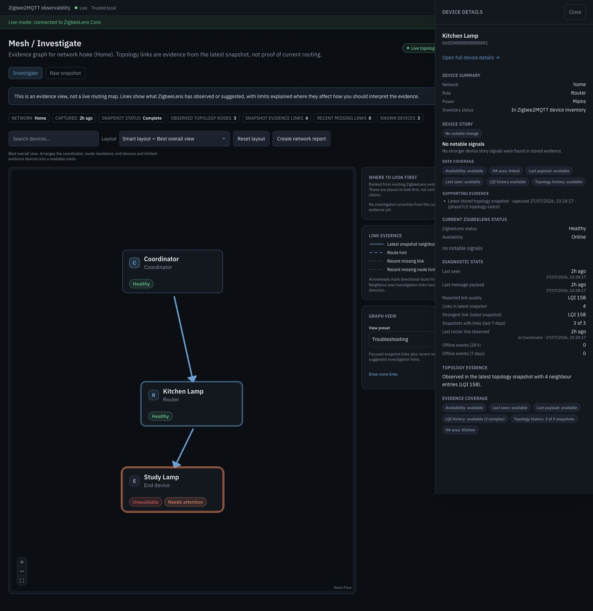
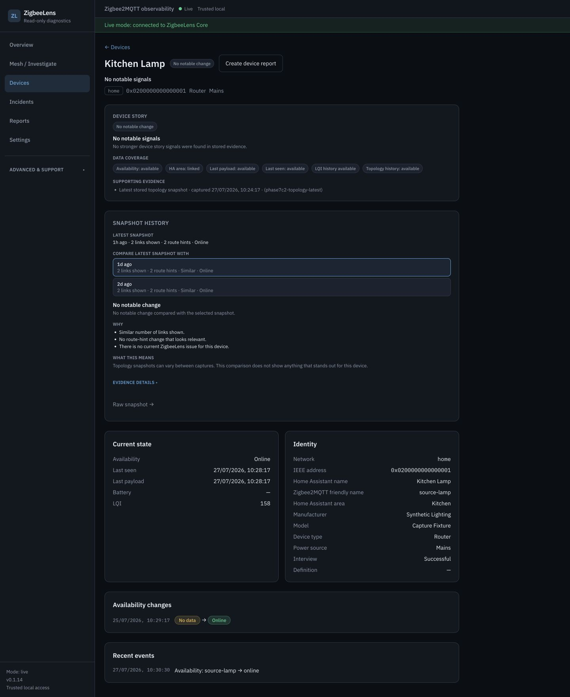

# Topology snapshots

ZigbeeLens can ask Zigbee2MQTT for point-in-time network-map evidence. The
result can add context to investigations, but topology is not required for
passive diagnostics and is never proof of a current route or cause.

## Capture and storage

A capture:

1. publishes `{"type":"raw","routes":true}` to the single allowlisted request
   topic `{base_topic}/bridge/request/networkmap`;
2. receives the exact response topic
   `{base_topic}/bridge/response/networkmap`;
3. secret-scrubs the snapshot-level raw payload and parses nodes, neighbour
   links, and route counts;
4. stores the governed scrubbed snapshot representation plus normalized typed
   node/link facts in local SQLite.

The parser does not retain original node/link dictionaries. New node/link
`raw_json` columns contain `{}`, and snapshot `parsed_json` is `NULL`.
Normalized router, end-device, and link counts remain in their typed columns.
The only retained source-shaped representation is `raw_redacted_json`, after
the existing snapshot scrubber.
Schema target `15` applies the same contract to older rows through
`015_topology_raw_data_scrub.sql`; it preserves normalized facts and leaves
`014_report_v3_only_reset.sql` unchanged.

Normalized topology rows still include IEEE addresses and may include friendly
names.
Report redaction does not anonymize the topology tables themselves. Protect the
SQLite database, its backups, and topology APIs as local diagnostic data.

Network-map requests can temporarily make a Zigbee network less responsive,
especially on larger networks. They never issue device `/set`, permit-join,
remove, reset, configure, bind/unbind, OTA, or channel-change commands.

## What the evidence means

| Evidence | Safe interpretation |
|----------|---------------------|
| Observed neighbour link | A neighbour relationship Zigbee2MQTT reported at capture time |
| Route hint | Directional route-table evidence present in the captured link (`route_count > 0`) |
| Recent missing link | A relationship in recent earlier usable snapshots that was not present in the latest usable snapshot |
| Last-known link | The most recently stored evidence available for a device when the latest evidence does not contain that relationship |
| Suggested investigation link | A passive-derived reason to review two devices together; not topology evidence |

Neighbour-table and route-table evidence are different. ZigbeeLens does not
derive a route hint from LQI, adjacency, or a relationship label. A capture-time
route hint does not identify a current route. A link absent from a later
snapshot does not prove that a connection failed; sleepy devices can age out of
neighbour tables.

When a response is missing, incomplete, unparseable, or contains no usable
node/link layout, ZigbeeLens reports limited/unavailable evidence. It does not
turn unavailable evidence into a measured empty mesh.

Device snapshot history preserves that distinction for every retained capture:

- an **available** layout reports whether the device was represented and gives
  measured link and route-hint counts, including a factual zero;
- a **limited** layout reports device presence and both counts as unavailable,
  never as absence or zero.

A retained node or source/target link is positive evidence for that device in
the exact snapshot where it was stored. Snapshot comparisons are produced only
when both the latest and selected snapshots have available layouts. Those
comparisons include the measured device-presence value from each layout as
typed evidence alongside link and route-hint counts. If only presence differs,
the comparison is **Changed**, or **Worth reviewing** when a separately
established current issue exists; it never claims failure, movement, a current
route, or causality. A limited layout therefore cannot create an absence,
no-links, changed, no-change, or watch conclusion.

Device coverage accounts for the complete retained window explicitly:

- `complete_snapshot_count = available_layout_snapshot_count +
  limited_layout_snapshot_count`;
- `snapshot_window_count` is retained as an exact alias of
  `complete_snapshot_count`, never an available-layout-only denominator;
- `observed_snapshot_count` counts only available layouts in which the exact
  device appears as a node or link endpoint, and cannot exceed
  `available_layout_snapshot_count`.

No complete captures means no stored history conclusion. All-limited history is
unavailable and supports no presence inference. Mixed available/limited history
is partial/sparse and always discloses the limited capture count. Only when
every selected complete capture has an available layout can coverage say the
device was observed in all, some, or none of those layouts. A limited layout is
unknown evidence, never zero or absence.

## Current investigation surfaces

> **Screenshot status:** Phase 7C2 is complete. PR #108 merged reviewed head
> `1ea2949ab09038cdfe94d1c6d6b8e5fd45d8d87f` as evidence merge
> `93fb26617042ed46d8920a7b75a42e3ae9da4d62` with green required checks and
> the S4 recorded-severity `Incident` versus recorded-confidence `High` review
> resolved. The complete S1–S9 set was captured together on `2026-07-29` from
> immutable source
> `af04ee906b71de77ee6e0eb5d866c0647d502410`. Public HACS synchronization and
> final artifact pairing remain pending; Phase 7D remains blocked.



Illustrative synthetic release-candidate data. This final-candidate evidence
was captured from source `af04ee906b71de77ee6e0eb5d866c0647d502410` on
`2026-07-29`. Mesh / Investigate presents stored evidence around the selected
network, with the Kitchen Lamp drawer and **Open device details** action
visible. Graph lines and metric counts are capture-time observations, not proof
of a current route, causation, or complete history. The displayed Home
Assistant name and area are additional metadata.



Illustrative synthetic release-candidate data. This final-candidate evidence
was captured from source `af04ee906b71de77ee6e0eb5d866c0647d502410` on
`2026-07-29`. Device Detail presents the Kitchen Lamp Home Assistant name and
area alongside preserved `source-lamp` Zigbee2MQTT identity. Its current Device
Story, available and limited coverage, and selected earlier `Changed`
comparison are historical evidence with unavailable values left unavailable;
they do not prove a current path, movement, parent, failure, or cause.

## Product surfaces

Primary device comparison:

1. Devices → Device Detail
2. Device Story
3. Snapshot history (recent complete captures, with comparison only when the
   latest and selected captures both contain available node/link layouts)

The Mesh device details panel links to full Device Detail rather than
duplicating snapshot-history comparison. Router- and Coordinator-led
investigation cards use **Open device details** because the destination is the
same generic Device Details drawer.

Advanced and support routes:

- `/topology` — capture status and per-network raw snapshot entry
- `/topology/:networkId` — exact point-in-time raw detail

Whole-network `GET /api/v1/topology/{network_id}/snapshots/compare` remains an
API/debug capability, not a primary product workflow.

`topology.enabled` controls capture and response-subscription posture, not
authorization to read retained snapshots. When capture is disabled, configured
network cards and already stored snapshot detail remain readable; capture
actions stay unavailable.

## Default behaviour

The Core source defaults are:

```yaml
features:
  manual_network_map: false
  automatic_network_map: false

topology:
  enabled: true
  manual_capture_enabled: false
  automatic_capture_enabled: false
  automatic_capture_interval_hours: 24
  startup_scan: true
  startup_stable_delay_seconds: 60
  refresh_interval_seconds: 0
  capture_on_incident: false
  max_snapshots_per_network: 30
  warn_before_capture: true
```

In live mode, the default startup scheduler:

1. waits for the MQTT collector to connect;
2. waits until every configured Zigbee2MQTT bridge is observed online;
3. waits `startup_stable_delay_seconds`;
4. requests one snapshot per configured network.

This startup scan is configuration-authorized. It is not a manual action and
does not wait for a UI confirmation. After it completes, periodic active scans
are off by default and Core continues using passive MQTT evidence.

Disable capture and the topology response subscription with:

```yaml
topology:
  enabled: false
```

Disabled topology owns no service or scheduler. Other startup, interval,
automatic, and manual values cannot advertise capture activity or publish a
request while this gate is false; retained snapshots remain readable.

To retain topology response-subscription posture but skip the startup request:

```yaml
topology:
  enabled: true
  startup_scan: false
```

## Periodic capture

With `topology.enabled: true`, `refresh_interval_seconds > 0` selects periodic
capture at that interval without requiring the two older automatic-capture
flags. When it is `0`, the hours-based path runs only if all of these are
enabled:

```yaml
features:
  automatic_network_map: true

topology:
  enabled: true
  automatic_capture_enabled: true
  automatic_capture_interval_hours: 24
```

Periodic capture waits for collector and bridge readiness. Only one capture can
be pending in a Core process at a time. `capture_on_incident` is accepted by the
current configuration model but does not currently schedule an
incident-triggered capture.

When `topology.enabled` is false, a positive interval is inert: status reports
no automatic capture and Core owns no topology scheduler.

## Manual capture

Manual capture requires both feature gates:

```yaml
features:
  manual_network_map: true

topology:
  enabled: true
  manual_capture_enabled: true
```

The request must acknowledge the load warning with an exact JSON boolean:

```bash
curl -X POST http://localhost:8377/api/v1/topology/home/capture \
  -H 'Content-Type: application/json' \
  -d '{"confirmed": true, "reason": "manual_user_capture"}'
```

Add bearer authentication, or browser-session Origin and CSRF headers, when
required by the deployment. `"confirmed": "true"` is invalid.

## API

`/api/v1` is preferred; the same handlers are also mounted under `/api`.

| Method | Path | Purpose |
|--------|------|---------|
| GET | `/api/v1/topology` | Capture/status overview per network |
| GET | `/api/v1/topology/{network_id}` | Latest complete snapshot plus evidence/layout facts |
| GET | `/api/v1/topology/{network_id}/evidence-graph` | Composed current, historical, and passive-derived evidence |
| GET | `/api/v1/topology/{network_id}/snapshots` | Snapshot history |
| GET | `/api/v1/topology/{network_id}/snapshots/{snapshot_id}` | Exact stored snapshot detail |
| GET | `/api/v1/topology/{network_id}/snapshots/compare` | Whole-network debug comparison |
| GET | `/api/v1/topology/{network_id}/devices/{ieee_address}/snapshot-history` | Device-led history and comparison |
| POST | `/api/v1/topology/{network_id}/capture` | Manual capture; gated and confirmed |

IEEE path parameters are normalized to canonical lowercase before exact
indexed node/link lookups. Mixed-case spelling returns the same device evidence
without broadening the query into a case-folded table scan.

## Home Assistant enrichment

Core also exposes ZigbeeLens-local enrichment storage:

| Method | Path |
|--------|------|
| GET | `/api/v1/enrichment/status` |
| POST | `/api/v1/enrichment/homeassistant` |
| DELETE | `/api/v1/enrichment/homeassistant` |

The POST matches a supplied device by IEEE (high confidence) or by friendly
name within a supplied network (medium confidence), then stores the supplied
Home Assistant device/area metadata. The reviewed HACS enrichment manager
reconciles official registry snapshots through this exact contract; Core also
works without enrichment.

## Safety summary

- Collector subscriptions and topology publishing are separate paths.
- Only the exact configured-network `bridge/request/networkmap` topic is
  allowlisted for topology.
- The request uses QoS 0 and is not retained.
- Manual capture is feature-gated and confirmed.
- Startup capture is controlled by explicit configuration defaults and waits
  for readiness.
- Disabled topology owns no service, scheduler, or active capture status.
- Original parsed node/link source dictionaries are neither newly persisted nor
  exposed; migration 015 scrubs legacy rows.
- Evidence remains capture-time, incomplete, and non-causal.

See [safety-audit.md](safety-audit.md),
[ubiquitous-language.md](ubiquitous-language.md), and
[troubleshooting.md](troubleshooting.md).
